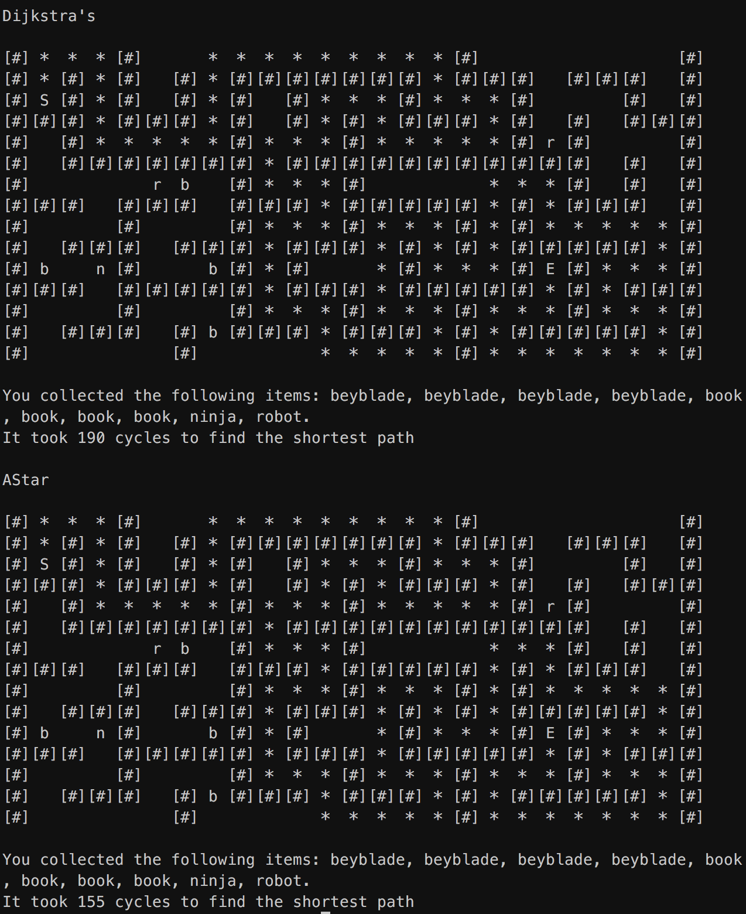
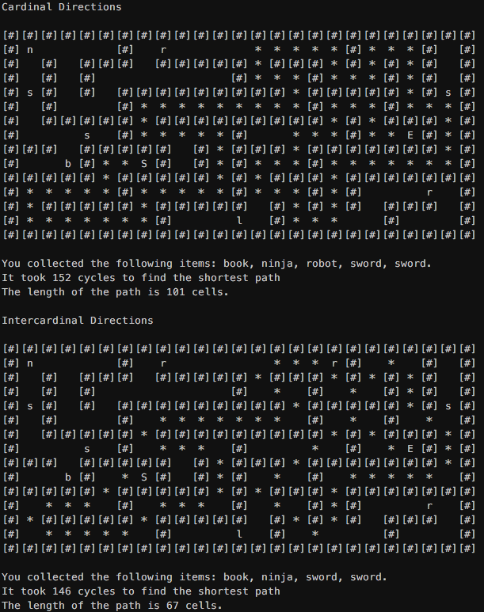
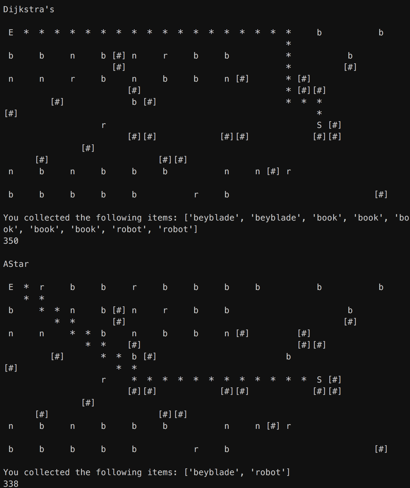
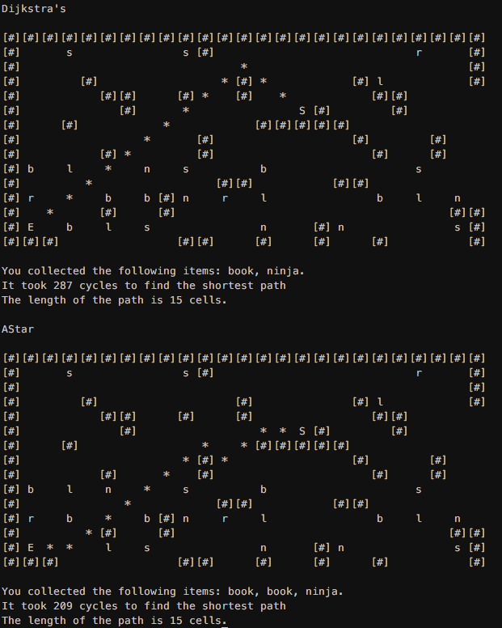
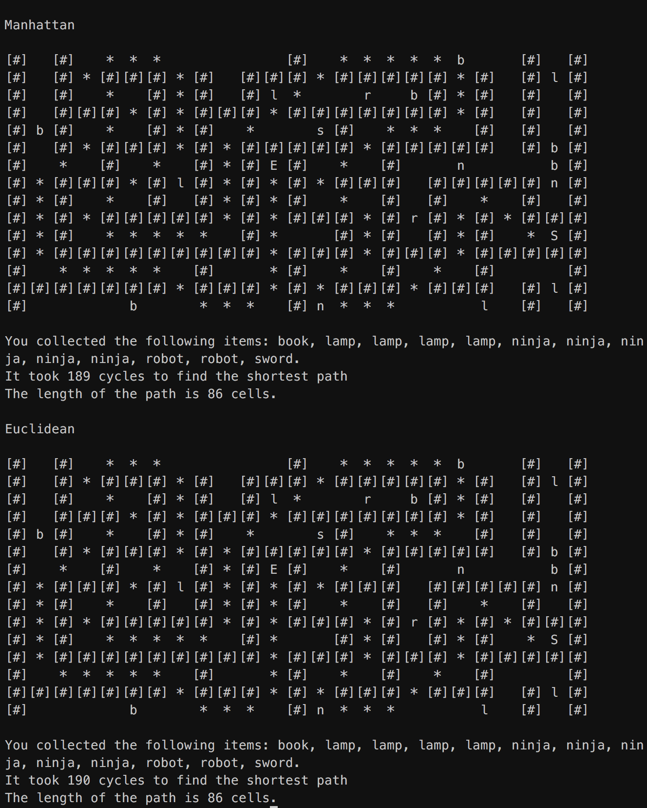
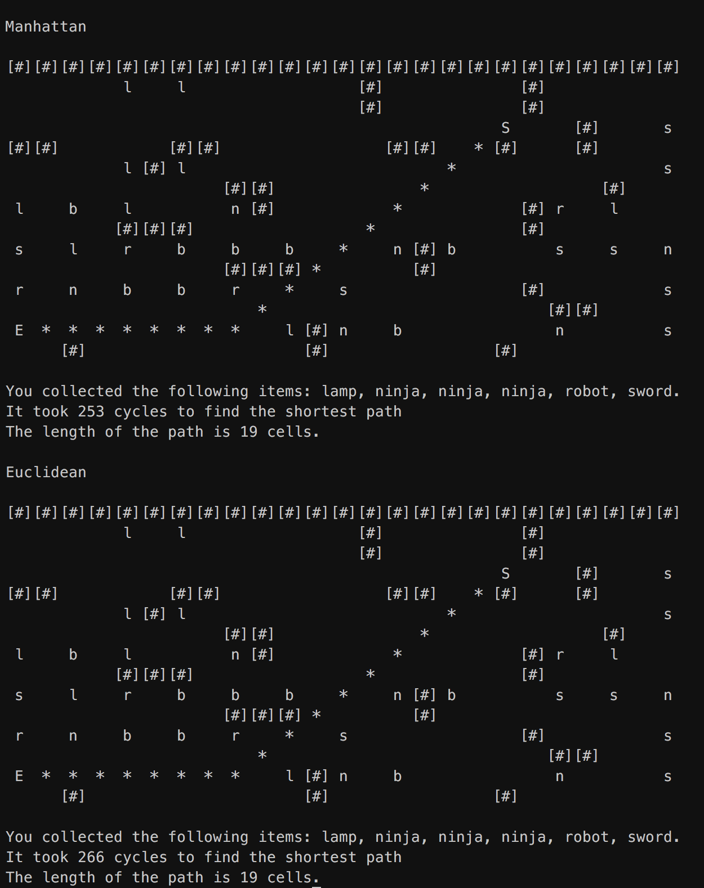

Convoluted Maze
===============

### Overview

The final project of the Codecademy Algorithms course requires generating a random maze that's littered with randomly placed swag items to collect. Using the techniques learnt through the course you then need to find a path through the maze collecting and sorting the swag you find along the way. 

### Examples

There are several runner files in the repository that demonstrate the maze being solved using both Dijkstra's Algorithm an the AStar algorithm as well as the other comparisons outlined in the solution.

They can all be run from the command line using `python3 <script_name.py>` from within the projects path.

- **maze_runner.py** - *Generates the standard maze and compares Dijkstra's with AStar*
- **landscape_runner.py** - *Generates a landscape and compares Dijkstra's with AStar*
- **cardinal_vs_intercardinal_astar.py** - *Compares AStar when using two different methods of finding neighbouring cells.*
- **manhattan_vs_euclidean.py** - *Compares AStar when using either the Manhattan or Euclidean heuristic*


## Solution

This solution compares Dijkstra's algorithm with AStar to solve a maze built on a grid. Both implementations collect items of swag left throughout the path and sort them using the Quicksort algorithm. 

### Maze

The maze provided as a starting point for the project is built on a grid structure. Due to this the algorithms used in the solution assume a fixed distance of 1 to the next cell. The maze also has only one path from the start cell to the end cell which mean that both algorithms tested will show the same path through the maze. Where the difference is noticed is in the number of cycles the algorithm runs to find the shortest path. 

For the purpose of this analysis a cycle occurs when the new distance of a neighbouring cell is less than its current saved distance. When this happens the distance, path and swag for that cell are updated and the count is incremented. Whilst Dijkstra's will build a list of distances and paths for all cells, AStar may never calculate the distance for a cell if the provided target is reached first. 

For Dijkstras to return the complete path of cells for plotting on the maze this implementation has been modified to collect the path for each cell checked. 



Here it's clear to see the benefit AStar brings when building paths. Both algorithms have arrived at the solution but in this example it took Dijkstra's 190 cycles and AStar 155 to get there. 

In the example above a neighbour is defined as a cell directly above, below, left or right of the current cell. This doesn't allow for diagonal movement which would allow corners to be cut creating a shorter path. If a neighbour is defined in terms of compass directions N, NE, E, SE, S, SW, W, NW, the path would be able to move around a right angle corner in one move rather than two. 

Let's see the result of comparing the AStar algorithm using these two different neighbour checking approaches. 

  

In this particular example there was a minor gain in the number of cycles it took before reaching the end however this wasn't always the case when running the script multiple times. Where the difference is noticed is in the length of the path taken to reach the end. Allowing diagonal movement has reduced the length of the path by 34 cells in this example.

There is a compromise with this method however. While it gains the advantage of moving around corners more efficiently, it skips over items of swag that could be collected. Here the first example collected all 5 items of swag on the path while the more efficient path only collected 4. 


### Landscape - An alternate maze

The provided maze demonstrates the added efficiency AStar brings through ending it's search when the target cell has been calculated. However to better visualise the difference the heuristic component of AStar produces, a maze allowing different solutions is needed. For this an alternate course or landscape has been used to show the impact the heuristic has on finding the most direct route. 

The landscape has been created by removing ('mowing' in the case of the script) an area of four cells that form a square rather than the maze which only removed two. For each of the 4 directions the following patterns apply.

```
Up 	  ##
	  ##
	  U

Down	D
		  ##
		  ##
		
Left	##L
		  ##

Right	R##
		  ##
```

This creates a much sparser field with isolated obstacles that the algorithm needs to navigate and the code for this can be found in `generate_landscape.py`.

In the following example you can clearly see how the heuristic impacts the direction the AStar algorithm takes. 




Now let's apply the same method of checking for neighbours in all directions as we did earlier. This should allow Dijkstra's to move diagonally and AStar to smooth out it's stepped diagonal movement. 

 

This example highlights again the direct route AStar can achieve using heuristics to guide the path towards  the cells closest to the end. Even though they both find a path with the same length, AStar finds a path that tracks more directly towards the target. AStar also shine when it comes to the number of cycles taken to reach the end with a count of 209 as opposed to Dijkstra's which took 287.


### Heuristics

It's worth making mention of the results obtained when using different heuristics with the AStar algorithm. The following example compares the the Manhattan heuristic with the Euclidean heuristic using the complete set of intercardinal directions for checking neighbours.



It's expected that within the constrains of the maze and using all intercardinal directions that the length of the path will be the same. In this particular example the Manhattan heuristic comes out in front by one cycle however this was not always the case in other tests. 

Here are results from running the script 10 times. 40% of runs were the same, 40% of the runs Manhattan came out in front leaving only two runs where Euclidean showed an advantage. The maximum variance between heuristics was only 4 cycles.

| Test No. | Manhattan | Euclidean |
| -------- | --------- | --------- |
| 1        | 166       | 166       |
| 2        | 179       | 179       |
| 3        | 159       | 162       |
| 4        | 187       | 187       |
| 5        | 130       | 134       |
| 6        | 180       | 180       |
| 7        | 172       | 173       |
| 8        | 182       | 178       |
| 9        | 192       | 193       |
| 10       | 140       | 138       |


Larger gains were noticed when running the same comparison through the landscape course. Here the Manhattan heuristic regularly showed an advantage over the Euclidean. 



This example shows a significant improvement when using the Manhattan heuristic with a difference of 13 cycles to the Euclidean.

Conducting the same test as we did for the maze confirms this result. 

| Test No. | Manhattan | Euclidean |
| -------- | --------- | --------- |
| 1        | 277       | 294       |
| 2        | 248       | 255       |
| 3        | 210       | 215       |
| 4        | 197       | 185       |
| 5        | 268       | 280       |
| 6        | 287       | 288       |
| 7        | 232       | 245       |
| 8        | 260       | 274       |
| 9        | 194       | 194       |
| 10       | 274       | 297       |

Only two runs of the script, 4 and 9, show results where Manhattan isn't ahead of Euclidean and in test 9 they show the same result. 

From this simple test it's would be fair to say that the Manhattan heuristic performs better when finding the path through a grid based course. 


### Sorting

As the path through the maze is being discovered, each cell is check for swag and if an item is found it's collected and sorted for display. The items are collected using a Python dictionary with a key of the cell co-ordinates and a value of the found item. The dict is then passed to a sorting algorithm for sorting alphabetically. 

For this solution both Quicksort and Mergesort have been implemented and can be interchanged in the `landscape_runner.py` by simply commenting out the line that uses Quicksort and un-commenting the line that uses Mergesort. 

Even though Quicksort has a worst case runtime of O(N^2), it's average (dependant on good random pivot selection) is O(N log(n)). Given the list of swag items is quite small and Quicksort requires less resources to operate, it's a good choice for this application.

